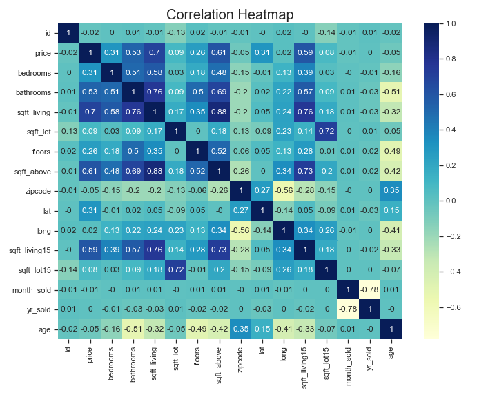

## REAL ESTATE DATA ANALYSIS PROJECT

*** GROUP MEMBERS ***
- Prossy Nansubuga Kamau -prossykamau@gmail.com
- Evaclaire Wamitu - evamunyika@gmail.com
- Julius Kinyua - juliusczar36@gmail.com
- Joan Nyamache - kerubonyamache@gmail.com
- Elizabeth Masai -elizabethchemtaim@gmail.com
- Kelvin Mwaura - kelvin.mwaura1@student.moringaschool
### PROJECT OVERVIEW 
The project aims to assit the real estate agents in  King County to adrress the need for precise house price estimation by developing a robust predictive model .To achieve this,we will undertake  indepth analysis of the real estate data provided ,which includes ,historical sales, current listings, property attributes, and other relevant features
The goal of the analysis is to find the most infuential factors driving house prices and ascertain their correlation with each other.

### BUSINESS PROBLEM
In this real estate market,estimation of  house prices accurately is vital for  home owners that is both buyers and sellers.Achieving this goal depends heavily on  identifying and understanding the key factors influencing house prices. If these factors are not well taken into consideration,stakeholders may have a hard time in making sound decisions leading to potential loses to both parties.
### DATA UNDERSTANDING
This project will make use of data from King County Housing Dataset.The Dataset has  21597  entries and 21 columns ,one of them being the price column  which is the target variable while the rest  will be used to make predictions.The dataset contains categorical and numerical columns, with data types of integers, objects, and floats.

### DATA PREPARATION AND CLEANING
This is marked by importing relevant libraries such as pandas,seaborn,matplotlib,statsmodel and scipy to be used in cleaning,analysis and modelling.Dataset is then loaded using pd as we observe our columns to understand the independent variables to analyse  with the price.Most of the columns are numerical making it suitable for regression analysis.  
Data cleaning involves checking for validity,accuracy,completeness consistency and uniformity of data.We will drop id and date column since there is no use for it,check for null values and replace them and also fill the missing values. 

### DATA VISUALIZATION
Before performing modelling,visualization is done to analyse some of the trends in the data.
A Correlation Heat Map will be created to identify the variables that most correlates with the target variable-Price.This is also  used to check for multicollinearity of features.

***HeatMap***

#
From the HeatMap,there is a relatively strong positive correlations between  price and sqft_living at   0.7, sqft_above at 0.61, sqft_living15 at 0.59 and number of bathrooms at 0.53.
The weakest inverse correlations were between price and zipcode and age at -0.05, and month sold at    -0.01.

