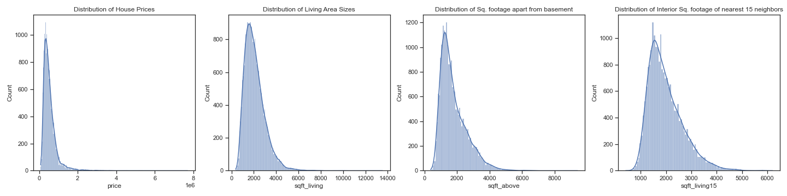
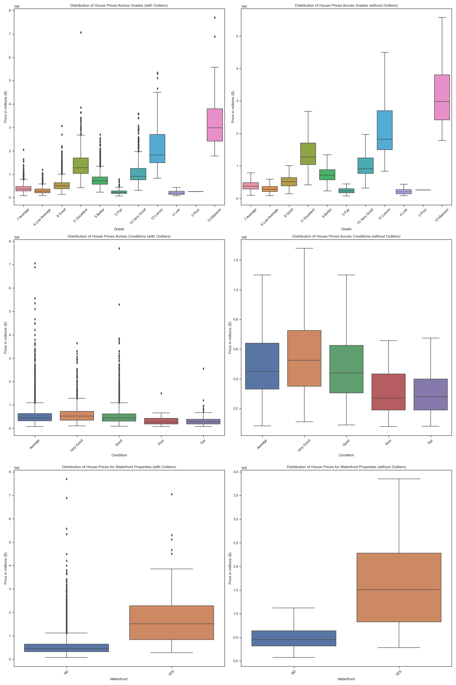

## REAL ESTATE DATA ANALYSIS PROJECT

*** GROUP MEMBERS ***
- Prossy Nansubuga Kamau -prossykamau@gmail.com
- Evaclaire Wamitu - evamunyika@gmail.com
- Julius Kinyua - juliusczar36@gmail.com
- Joan Nyamache - kerubonyamache@gmail.com
- Elizabeth Masai -elizabethchemtaim@gmail.com
- Kelvin Mwaura - kelvin.mwaura1@student.moringaschool
- Mourine kitili- mourinekitilimourine@gmail.com

### PROJECT OVERVIEW 

The project aims to assit the real estate agents in  King County to adrress the need for precise house price estimation by developing a robust predictive model .To achieve this,we will undertake  indepth analysis of the real estate data provided ,which includes ,historical sales, current listings, property attributes, and other relevant features
The goal of the analysis is to find the most infuential factors driving house prices and ascertain their correlation with each other.

### BUSINESS PROBLEM

In this real estate market,estimation of  house prices accurately is vital for  home owners that is both buyers and sellers.Achieving this goal depends heavily on  identifying and understanding the key factors influencing house prices. If these factors are not well taken into consideration,stakeholders may have a hard time in making sound decisions leading to potential loses to both parties.

### DATA UNDERSTANDING

This project will make use of data from King County Housing Dataset.The Dataset has  21597  entries and 21 columns ,one of them being the price column  which is the target variable while the rest  will be used to make predictions.The dataset contains categorical and numerical columns, with data types of integers, objects, and floats.

### DATA PREPARATION AND CLEANING

This is marked by importing relevant libraries such as pandas,seaborn,matplotlib,statsmodel and scipy to be used in cleaning,analysis and modelling.Dataset is then loaded using pd as we observe our columns to understand the independent variables to analyse  with the price.Most of the columns are numerical making it suitable for regression analysis.  
Data cleaning involves checking for validity,accuracy,completeness consistency and uniformity of data.We will drop id and date column since there is no use for it,check for null values and replace them and also fill the missing values. 

### DATA VISUALIZATION

Before performing modelling,visualization is done to analyse some of the trends in the data.
A Correlation Heat Map will be created to identify the variables that most correlates with the target variable-Price.This is also  used to check for multicollinearity of features.

***HeatMap***

From the  above HeatMap,there is  relatively strong positive correlations between  price and sqft_living at   0.7, sqft_above at 0.61, sqft_living15 at 0.59 and number of bathrooms at 0.53.
The weakest inverse correlations were between price and zipcode and age at -0.05, and month sold at    -0.01.

***Histograms***

This will be used to explore the distribution of variables with the strongest positive relationships with price.

From the histograms above,we can conclude that our variables follow a normal distribution with skewness and kurtosis in all the distributions.

***Bar Plots***

These visuals will help analyze the variation of average house prices as per the overall condition of the house ,that is whether the house is located in a water front or not,the quality of views from the house and the number of levels in the house.

***Scatter Plots***

We will create a grid of scatter plots to visualize and better explore the relationships between variables and check if they pass the assumptions of linear regression.That is Linearity,Homoscedasticity and normality assumptions.

### MODELING

In this section,Ordinary Least Squares (OLS) will be used  and the values that will be looked at in the summary will be R-squared and P-values.
R-squared communicates the level of variance around our target variable(Price) that can be explained by the model.P-value on the other hand is used to check the null hypothesis ,that is if there is a relationship between the target(price)   and the chosen variables.If the p-value is  not less than 0.05,we fail to reject the null hypothesis.

***General Overview***

We will take a general overview on the variables that have a strong correlation with the price. 
Based on the visualization done above,it is evident that the square footage of living space (sqft_living) shows the strongest positive correlation with the price, marked at 0.7,this indicates a significant impact of the size of the living area to price.On the other hand the year the house was built has a weaker positive correlation  of 0.5 .

***Simple Linear Regression Model***

In this model ,we will use price as the dependent variable  and sqft_living as the independent variable to determine the coefficient and the y-intercept.
The model has an R-squared value of 0.49 expolaining 49% variation in price ,making it statistically significant.The intercept  and coefficient  for sqft_living are approximately -$43,990 and 281, respectively, both of which are statistically significant.
We will also come up with a qqplot which gives an indication that  using a polynomial regression for price and sqft_living would have been more effective .

***Multiple Linear Regression Model***

This model incorporates all the other independent variables to understand their impact on price.We will introduce dummies for the categorical data.
This model has an approximate R-squared of 0.6 indicating a 60% variance in price.It is  however off by $156,659 as given by our mean absolute error.

!

